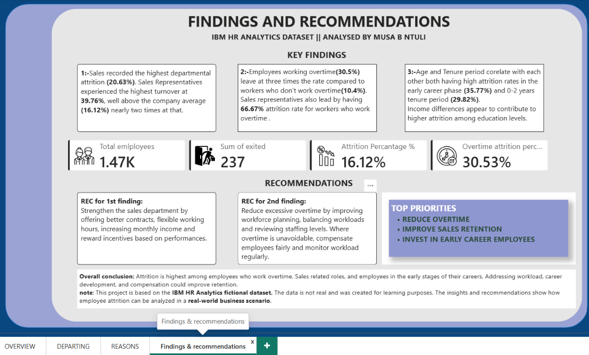

# IBM HR Attrition Analysis

## Project Objective

The objective of this project was to analyse employee attrition using
PostgreSQL and Power BI to identify the factors most associated with
employees leaving the company. I cleaned and prepared the data in
PostgreSQL, built an interactive Power BI dashboard, and used the
findings to make practical recommendations that could help improve
employee retention.

------------------------------------------------------------------------

## Dataset

-   **Source:** IBM HR Analytics Employee Attrition & Performance
    (Kaggle)
-   Fictional dataset created by IBM for educational purposes
-   **1,470 employee records**
-   **35 columns (15 used for the analysis)**

------------------------------------------------------------------------

## Tools Used

-   PostgreSQL
-   DBeaver
-   Power BI
-   DAX

------------------------------------------------------------------------

# Dashboard Preview

### Interactive Dashboard

### Departing Page

### Reasons Page

------------------------------------------------------------------------

# Project Workflow

### 1. Database Setup

I created the database table, imported the dataset into PostgreSQL and
assigned the correct data types during the import process.

### 2. Data Inspection

I checked for duplicate employee IDs, null values and unnecessary
columns. EmployeeCount, Over18 and StandardHours contained the same
value for every record, so they were excluded.

### 3. Data Preparation

I created a clean working table containing only the columns needed for
the analysis.

### 4. SQL Analysis

I built SQL views to analyse attrition by department, gender, job role,
overtime, education, tenure, satisfaction, work-life balance and salary.
I also created a row-level base view with attrition and overtime flags
for Power BI.

### 5. Power BI Dashboard

Using the base view, I created DAX measures, KPI cards, interactive
visuals and slicers. Calculated columns were used to convert coded
values into readable categories.

### 6. Findings and Recommendations

I summarised the main findings, linked them to business recommendations
and created an employee lifecycle process map showing where attrition
risks occur.

------------------------------------------------------------------------

# Key Findings

-   Overall attrition rate was **16.12%** (237 out of 1,470 employees).
-   Employees working overtime had an attrition rate of **30.53%**,
    compared to **10.44%** for employees who did not work overtime.
-   Sales Representatives recorded the highest job role attrition at
    **39.76%**, while the Sales department recorded the highest
    departmental attrition at **20.63%**.
-   Lower job satisfaction, environment satisfaction and work-life
    balance scores were consistently linked to higher attrition.
-   Employees who left generally earned less than those who stayed
    within the same education level.

------------------------------------------------------------------------

# Recommendations

-   Reduce excessive overtime by improving workload planning and
    staffing levels.
-   Strengthen retention in the Sales department through better career
    development, flexible working and performance-based incentives.
-   Improve onboarding with mentorship, structured training and regular
    check-ins during employees' first two years.
-   Conduct regular employee check-ins and monitor satisfaction to
    identify issues before employees decide to leave.
-   Introduce structured exit interviews to better understand why
    employees leave.

------------------------------------------------------------------------

# Project Files

-   `HR_RAW_TO_CLEAN.sql` -- data import, cleaning and preparation
-   `hrdata_to_attrition_views.sql` -- SQL analysis views and Power BI
    base view
-   `HR_Analytics_Dashboard.pbix` -- Power BI dashboard
-   `process_map.png` -- Employee lifecycle process map

------------------------------------------------------------------------

# Limitations

-   This project uses the IBM HR Analytics fictional dataset created for
    learning purposes.
-   The dataset is a single snapshot and cannot show trends over time.
-   Attrition is recorded only as Yes or No and does not distinguish
    between voluntary and involuntary exits.
-   The analysis identifies relationships in the data but cannot prove
    cause and effect.
